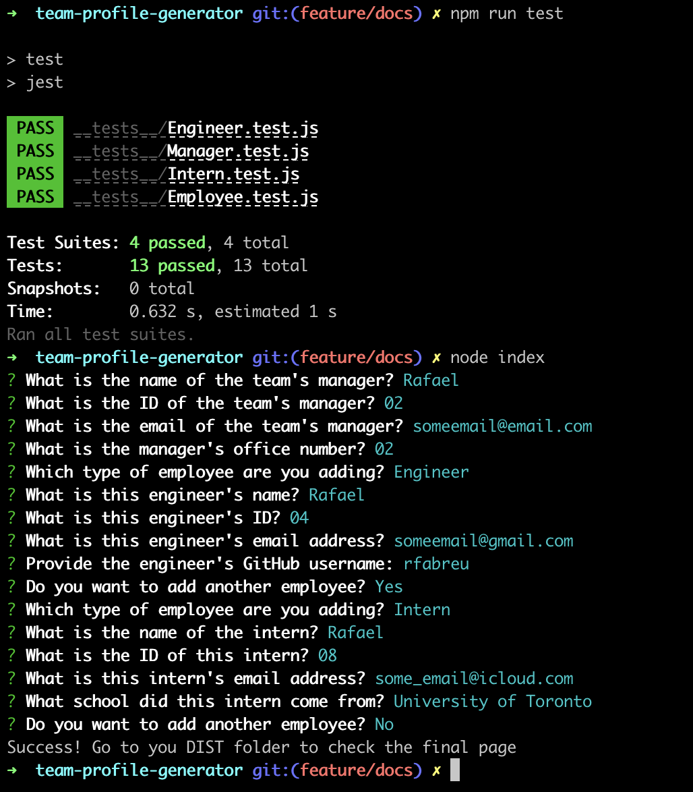

# team-profile-generator

## Description:
 The Team Profile Generator is a `CLI` application built with `Node.Js`, that takes in information about employees on a team and generates an HTML webpage that displays summaries for each individual. Allowing for quick consults to an employee directory.

## Table of Contents
- [Description](#description)
- [Installation](#installation)
- [Usage](#usage)
- [License](#license)
- [Contributing](#contributing)
- [Tests](#tests)
- [Feedback](#feedback)
## Installation
- `Clone` the repository:
  - Ensure you have `Node.Js` installed
  - `cd` into `team-profile-generator` and run `npm i` or `npm install`
## Usage
From the `terminal` ensure that you are in `team-profile-generator` and call the application by running `node index.js` or `node index`. Answer the `prompts` and follow the instructions to access and use your page.

## Demo

 - [Click to view demo video!](https://drive.google.com/file/d/1OjrOixjy2oxkMvB48LX2NH_UZ53EdbPu/view)

### `CLI` Inputs:

 
 

### Result Output:

 

## License
This project is licensed under the MIT License.
## Contributing
If you wish to contribute to the project you may reach out or `fork` this repository and submit `pull requests`.
## Tests
If you would like to run tests before running the application you can do it using `jest`. Some tests have been created during the development process following `TDD` practices to ensure a successful run. You can call the tests from the `CLI` by running `npm run test`.
## Feedback
GitHub: [github.com/rfabreu](https://github.com/rfabreu)  
Comments, suggestions, questions? Contact me at: [rafael.gomes@mail.utoronto.ca](mailto:rafael.gomes@mail.utoronto.ca)